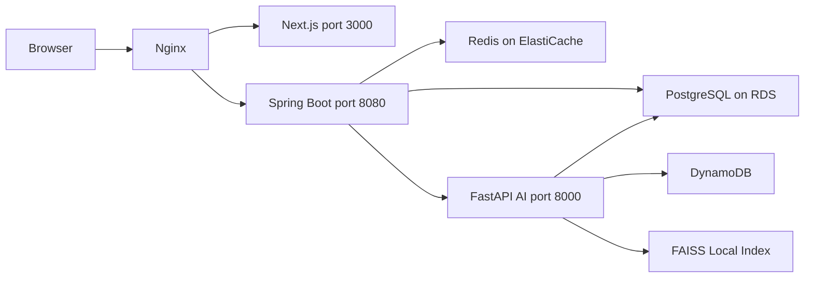

# devpick-ai

> DevPick 플랫폼의 FastAPI AI 서버입니다.  
> 전체 프로젝트 소개는 [Devpick-Org](https://github.com/Devpick-Org) 에서 확인할 수 있습니다.

---

## 기술 스택


| 구분 | 기술 | 비고 |
|------|------|------|
| 언어 | Python 3.12 | |
| 프레임워크 | FastAPI 0.116 | |
| LLM | Claude Haiku 4.5 / Sonnet 4.6 | AWS Bedrock Converse API + Tool Use |
| 임베딩 | Amazon Titan Embeddings v2 | AWS Bedrock |
| DB (관계형) | PostgreSQL | AI 서버가 직접 저장 (Backend push 없음) |
| DB (비정형) | Amazon DynamoDB | 요약·퀴즈·RAG·이벤트 로그 |
| 벡터 검색 | FAISS | 로컬 인덱스 (`data/vectors/`) |
| RAG | LangChain + FAISS | 청킹·임베딩·검색 |
| 형태소 분석 | kiwipiepy | 한국어 TF-IDF 전처리 |
| 태그 정규화 | rapidfuzz | 유사 태그 병합 |
| 스케줄링 | APScheduler | 수집·트렌드 배치 |
| 린트/포맷 | ruff, black | CI 자동 체크 |
| 테스트 | pytest | CI 자동 실행 |

---

## 시스템 구조



```
브라우저
  └─ Nginx
      └─ Next.js (프론트, :3000)
          └─ Spring Boot (백엔드, :8080)
              ├─ PostgreSQL (:5432)      ← 콘텐츠·트렌드 저장
              ├─ Redis (:6379)           ← 요약·퀴즈 캐시
              └─ FastAPI AI 서버 (:8000)   ← 이 레포
                  ├─ DynamoDB (AWS)      ← 요약·퀴즈·RAG·로그 저장
                  └─ FAISS (로컬)        ← 콘텐츠·질문 벡터 인덱스
```

---

## 주요 기능

| 기능 | 설명 |
|------|------|
| **콘텐츠 수집** | 30개 소스(국내외 기업 블로그, Velog, Stack Overflow, YouTube 등) 통합 수집 → PostgreSQL 저장 |
| **4레벨 AI 요약** | 입문·주니어·중급·시니어 수준별 요약 자동 생성 (Claude Haiku, Bedrock 1회 호출) |
| **4레벨 퀴즈 생성** | 레벨별 문제·보기·해설 자동 생성 (Claude Haiku, 요약과 독립 실행) |
| **RAG 질문 답변** | FAISS 벡터 검색 + Claude Tool Use 기반 AI 답변 생성 |
| **채용 AI** | JD 파싱 · 면접 Q&A 생성 · 스킬 갭 분석 · 모의면접 (Claude Sonnet) |
| **이력서 처리** | 이력서 텍스트 → 마스터 이력서 JSON 파싱 · 보강 |
| **트렌드 분석** | 일/주/월 단위 태그 빈도 · TF-IDF · LLM 서사 요약 → PostgreSQL 저장 |
| **리포트 키워드 추출** | 읽은 글·질문 목록 → TF-IDF 키워드 추출 (DB 저장 없음) |

---

## AI 처리 파이프라인

수집부터 PostgreSQL 저장, AI 처리까지 AI 서버가 직접 담당합니다.

```
통합 수집기 (Backfill + Incremental)
    ↓
NormalizeService → NormalizedContent
    ↓
ContentRepository → PostgreSQL 직접 저장
    ↓ (신규 저장 콘텐츠만)
ContentPipeline.process_content()
    ├─ Step 1:   PreprocessService          — HTML → 구조 보존 텍스트
    ├─ Step 2:   AllLevelsSummaryService    — 4레벨 요약 (Claude Haiku, Bedrock 1회)
    ├─ Step 3:   SummaryRepository         — DynamoDB ai_summaries 저장
    ├─ Step 3-1: ContentRepository         — PostgreSQL tags·category UPDATE
    ├─ Step 4:   QuizService               — 4레벨 퀴즈 (Claude Haiku, Bedrock 1회)
    │            QuizRepository            — DynamoDB ai_quizzes 저장
    └─ Step 5:   EmbeddingOrchestrator     — RAG 청크 임베딩 → DynamoDB + FAISS
```

- 요약(Step 2~3)과 퀴즈(Step 4)는 독립 실행 — 요약 실패해도 퀴즈 생성 계속
- Step 3-1은 요약 성공 시에만 실행 — AI 생성 tags·category를 PostgreSQL에 반영
- Backend는 Redis → DynamoDB 순서로 조회, miss 시 fallback 엔드포인트 호출

### 수집 소스 (30개)

| 카테고리 | 소스 |
|----------|------|
| 국내 기업 블로그 | Kakao Tech · NAVER D2 · Toss Tech · OliveYoung Tech · 우아한형제들 · 쏘카 · SK Planet · 농심 클라우드 · KakaoPay Tech · Flex Tech |
| Medium 출판물 | 당근 · 무신사 · 마이리얼트립 · Netflix TechBlog · Airbnb Engineering · Pinterest Engineering · 여기어때(GC컴퍼니) · Flutter |
| 글로벌 기업 블로그 | Meta Engineering · GitHub Blog · AWS Korea · Cloudflare · Microsoft DevBlogs · NVIDIA Developer · Google Developers · Grab Engineering · Spring Blog · Next.js Blog |
| 기술 커뮤니티 | Velog (GraphQL) · Stack Overflow (API) |
| 영상 | YouTube (Data API v3, 별도 파이프라인) |

---

## 트렌드 분석 파이프라인

일/주/월 단위로 태그 빈도·TF-IDF·외부 신호·LLM 서사 요약을 생성하고 PostgreSQL `trend_snapshots`에 저장합니다.

```
TrendOrchestrator.run(unit, period_start, period_end)
    ├─ TrendDataLoader              — PostgreSQL 콘텐츠 + 조회수 4개 병렬 쿼리
    ├─ TagNormalizer                — rapidfuzz 기반 유사 태그 병합
    ├─ FrequencyAnalyzer            — 태그 빈도 집계 + 증감 상태 (new/up/down/same)
    ├─ KoreanTokenizer + TfidfAnalyzer — kiwipiepy 형태소 분석 + TF-IDF 키워드 추출
    ├─ ExternalSignalFetcher        — GitHub Trending · HN Algolia · dev.to 외부 신호
    ├─ TrendRanker                  — 내부 신호 + 외부 신호 가중치 합산 순위 계산
    ├─ TopPostsSummaryGenerator     — Top 5 콘텐츠 LLM 서사 요약 (Bedrock)
    ├─ CollectionSummaryGenerator   — 수집 동향 LLM 서사 요약 (weekly/monthly만)
    └─ TrendSnapshotRepository      — trend_snapshots upsert + Backend 캐시 무효화
```

- `force=False`이고 동일 기간 스냅샷이 이미 있으면 재생성 없이 즉시 반환
- LLM 실패 시 해당 요약 필드만 `null`로 저장, 스냅샷 저장은 계속 진행

---

## Internal API

Spring Boot ↔ FastAPI 내부 통신 전용입니다.  
`Base URL: http://ai-server:8000/internal`

모든 엔드포인트에 `X-Internal-Key` 헤더가 필요합니다.

### 콘텐츠 AI

| 메서드 | 경로 | 설명 |
|--------|------|------|
| GET | `/internal/health` | 내부 헬스체크 |
| POST | `/internal/summaries` | 4레벨 동시 요약 생성 + DynamoDB + RAG 임베딩 (fallback) |
| POST | `/internal/quiz` | 4레벨 퀴즈 생성 + DynamoDB 저장 (fallback) |

### 질문 / 답변

| 메서드 | 경로 | 설명 |
|--------|------|------|
| POST | `/internal/refine` | 질문 AI 개선 생성 |
| POST | `/internal/answer` | AI 1차 답변 생성 (related_contents 주입) |
| POST | `/internal/similar-questions` | FAISS 인덱스 기반 유사 질문 검색 |
| POST | `/internal/similar-contents` | FAISS 인덱스 기반 유사 콘텐츠 검색 |
| DELETE | `/internal/questions/{question_id}` | 질문 삭제 시 ai_answers · rag_questions · FAISS 정리 |

### 채용 AI

| 메서드 | 경로 | 설명 |
|--------|------|------|
| POST | `/internal/jobs/parse-jd` | JD 텍스트 → 필수/우대 기술 추출 |
| POST | `/internal/jobs/interview-qa` | 공고·이력서 기반 면접 Q&A JSON 생성 |
| POST | `/internal/jobs/skill-gap` | 부족 기술 → 로드맵 · 학습 리소스 추천 |
| POST | `/internal/jobs/mock-interview/plan` | 모의면접 15문항 플랜 보강 |
| POST | `/internal/jobs/mock-interview/turn` | 모의면접 턴 평가 + 다음 행동 결정 |
| POST | `/internal/jobs/mock-interview/finalize` | 모의면접 종료 → 5영역 점수·모범답안·피드백 |

### 이력서

| 메서드 | 경로 | 설명 |
|--------|------|------|
| POST | `/internal/resume/parse` | 이력서 텍스트 → 마스터 이력서 JSON |
| POST | `/internal/resume/enrich` | 1차 파싱 스냅샷 + 원문 → 보강 패치 JSON |

### 트렌드 / 리포트

| 메서드 | 경로 | 설명 |
|--------|------|------|
| POST | `/internal/trends` | 트렌드 수동 생성 (디버그·장애 복구용) |
| GET | `/internal/trends/latest` | 최신 트렌드 스냅샷 조회 |
| POST | `/internal/report/content-keywords` | 읽은 글 목록 → TF-IDF 키워드 추출 |
| POST | `/internal/report/question-keywords` | 기술/커리어 질문 → TF-IDF 키워드 추출 |

---

## DynamoDB 테이블

| 테이블 | PK / SK | 내용 |
|--------|---------|------|
| `ai_summaries` | content_id / level | 4레벨 요약 결과 (beginner·junior·mid·senior) |
| `ai_quizzes` | content_id | 4레벨 퀴즈 결과 (레벨 중첩) |
| `rag_documents` | content_id / chunk_index | RAG 청크 + 임베딩 |
| `rag_questions` | question_id | 질문 임베딩 |
| `ai_answers` | question_id | AI 답변 결과 |
| `event_logs` | user_id / event_timestamp | AI 처리 이벤트 로그 (일별 dedup) |

---

## Getting Started

### 사전 요구사항

- Python 3.12
- Docker (DynamoDB Local, Redis 로컬 개발 시)
- `.env` 파일 — `.env.example` 참고

### 로컬 실행

```bash
git clone https://github.com/Devpick-Org/devpick-ai.git
cd devpick-ai
pip install -r requirements.txt -r requirements-dev.txt
cp .env.example .env   # 환경변수 설정 후
uvicorn main:app --reload
```

### 헬스체크

```bash
curl http://127.0.0.1:8000/health
# {"status":"ok"}
```

### 환경변수

| 변수 | 설명 | 필수 |
|------|------|------|
| `DATABASE_URL` | PostgreSQL 접속 URL | 필수 |
| `INTERNAL_API_KEY` | Spring ↔ AI 서버 인증 키 | 필수 |
| `AWS_REGION` | AWS 기본 리전 (`ap-northeast-2`) | 필수 |
| `BEDROCK_MODEL_HAIKU` | 요약·퀴즈용 모델 ID | 선택 |
| `BEDROCK_MODEL_SONNET` | 답변·채용 AI용 모델 ID | 선택 |
| `YOUTUBE_API_KEY` | YouTube Data API v3 | 선택 |
| `BACKEND_URL` | 트렌드 캐시 무효화 대상 URL | 선택 |

---

## 주요 스크립트

| 스크립트 | 설명 |
|----------|------|
| `scripts/run_backfill_batch.py` | 1회 수집 + PostgreSQL 저장 + AI 처리 (요약·퀴즈·임베딩) |
| `scripts/run_scheduler.py` | 6시간 간격 자동 수집 스케줄러 |
| `scripts/run_trend_batch.py` | 트렌드 분석 1회 (`--unit daily/weekly/monthly`, `--force`) |
| `scripts/run_trend_scheduler.py` | 트렌드 자동 스케줄러 (daily 00:05 / weekly 월 00:10 / monthly 1일 00:15 KST) |
| `scripts/run_youtube_batch.py` | YouTube 영상 1회 수집 |
| `scripts/run_youtube_scheduler.py` | YouTube 자동 수집 스케줄러 |
| `scripts/init_postgres.py` | PostgreSQL UNIQUE 인덱스 초기화 (배포 시 1회) |
| `scripts/init_vectors.py` | FAISS 인덱스 초기화 |
| `scripts/reindex_vectors.py` | FAISS 인덱스 재빌드 (인덱스 유실 시) |
| `scripts/reprocess_summary.py` | 특정 콘텐츠 요약 재생성 |
| `scripts/reprocess_quiz.py` | 특정 콘텐츠 퀴즈 재생성 |
| `scripts/sync_ai_metadata.py` | DynamoDB → PostgreSQL tags/category 동기화 |

```bash
# 1회 수집 실행
DATABASE_URL=postgresql://... python scripts/run_backfill_batch.py

# 수집 스케줄러 (6시간 간격)
DATABASE_URL=postgresql://... python scripts/run_scheduler.py

# 트렌드 분석
DATABASE_URL=postgresql://... python scripts/run_trend_batch.py --unit weekly
DATABASE_URL=postgresql://... python scripts/run_trend_batch.py --unit daily --force

# 트렌드 스케줄러
DATABASE_URL=postgresql://... python scripts/run_trend_scheduler.py
```

---

## CI/CD

| Job | 트리거 | 설명 |
|-----|--------|------|
| Lint | PR to developV2 | `ruff check .` |
| Format | PR to developV2 | `black --check .` |
| Test | PR to developV2 | `pytest -q` |
| Deploy | push to developV2 | EC2 SSH 자동 배포 |

로컬 사전 확인:

```bash
pip install -r requirements.txt -r requirements-dev.txt
ruff check . && black --check . && pytest -q
```

---

## 브랜치 전략

| 브랜치 | 용도 |
|--------|------|
| `main` | 배포용 |
| `developV2` | MVP 이후 통합 브랜치 |
| `feature/DP-{번호}-{기능명}` | 기능 개발 |
| `fix/DP-{번호}-{설명}` | 버그 수정 |

```bash
git checkout -b feature/DP-{티켓번호}-{기능명}
```

> PR 머지 대상은 `developV2`입니다. `main`은 배포 브랜치이므로 직접 푸시 금지.

---

## 팀

<table>
  <tr>
    <td align="center" width="180">
      <a href="https://github.com/suheon98">
        
      </a>
      <br />
      <strong>수헌</strong>
      <br />
      <sub>AI Lead</sub>
      <br />
      <a href="https://github.com/suheon98">@suheon98</a>
    </td>
  </tr>
</table>
